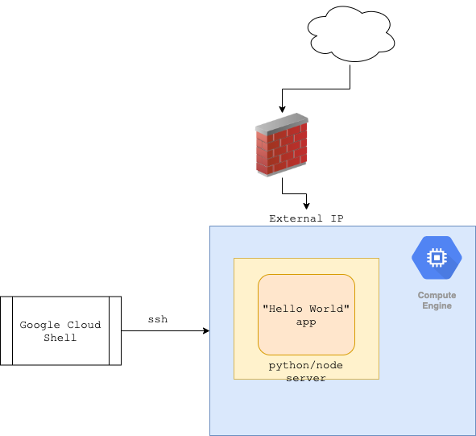
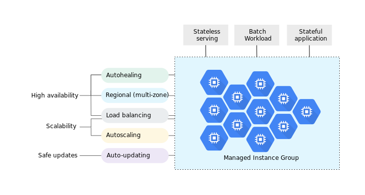

# 2. GCE

### Pre requisites

- [ ] have a basic understanding of linux OS.
- [ ] have a basic understanding of bash scripting.
- [ ] use package managers or have a basic understanding of how to install packages.

### Hello World on Compute Engine.


Compute Engine lets you create and run virtual machines on Google infrastructure. Compute Engine provides control of every component but also assumes it’s your responsibility to keep things running. With VMs, you obviously need to go ahead and install/configure your own web hosting stack from scratch (and also decide how to provide for load balancing and scalability, from a variety of options.)

The GCP documentation looks extremely useful, but who starts by reading the manual? Google Search to the rescue:

- “google compute engine create a vm”
- “google compute engine ssh into vm”
- “install python linux”
- “hello world python”
- “hello world python google compute engine”…

### Plan

- Create a VM on GCE (Linux obviously)
- Install python3 and/or node.js on the VM.
- Setup hello-world app provided in the repo.
- Run the app and expose it on a public IP address.
- Can we scale?



## 1. Create a VM on GCE

Navigate to VM Instances page in Google Cloud Console and go through the setup process.

- Instance name: changed to helloworld-vm
- Machine type: changed to small (1 shared vCPU, 1.7 GB memory)
- Zone: changed to us-west-a (I am based in Seattle, so selected one of the ‘west’ options available)
- Boot disk: Google Debian GNU/Linux 9 (default)
- Firewall: checked to allow both HTTP and HTTPS traffic

!!! pricing
    $14.20 per month estimated.

Hit the Create button. The VM instance is up and running in literally a few seconds.

- Connect via SSH.

if you prefer to use gcloud, you can use:

- SSH 🔽: View gcloud command

```bash
gcloud compute --project "kontinu" ssh --zone "us-west1-a" "helloworld-vm"
```


## 2. Install python3 and/or node.js on the VM

### Common packages

```bash
sudo apt-get update
sudo apt-get install -y curl git
```

### Python3

```bash
sudo apt-get update
sudo apt-get install -y python3 python3-pip
python --version
pip --version
```


### Node.js
Google Search: "Installing Node.js Tutorial: Debian Linux"

```
sudo apt-get update
sudo curl -sL https://deb.nodesource.com/setup_14.x | sudo -E bash -
sudo apt-get install -y nodejs

node --version
npm --version
```

## 3. Setup hello-world app provided in the repo.

```
git clone https://github.com/kontinu/gcp-bootcamp.git
cd gcp-bootcamp/src
```

### python

```
cd python/
pip3 install -r requirements.txt
python3 main.py
```

### node.js

```
cd nodejs/
npm install

node server.js
```

---


## 4. Run the app and expose it on a public IP address.

I search on [“google compute engine open firewall ports”](https://www.google.com/search?q=google+compute+engine+open+firewall+ports), which brings me to [StackOverflow](https://stackoverflow.com/questions/21065922/how-to-open-a-specific-port-such-as-9090-in-google-compute-engine). Then I open port 8080 for both http and https using Cloud Console (Networking > VPC Network):


???
    note: change https:// to http://


## 5. Can we scale?

Compute Engine does offer [load balancing and autoscaling for groups of instances](https://cloud.google.com/compute/docs/load-balancing-and-autoscaling) but it requires additional setup, maintenance, as well as general understanding of scalable web architectures and distributed systems design




Things to consider:
- instance templates
- Startup-scripts
- [MIG](https://cloud.google.com/compute/docs/instance-groups)
- [Tutorial](https://cloud.google.com/compute/docs/tutorials/high-availability-load-balancing)

## 6. Containers on GCE

Install Docker 🐳

```
curl -fsSL https://get.docker.com -o get-docker.sh
sh get-docker.sh


sudo curl -L "https://github.com/docker/compose/releases/download/1.29.2/docker-compose-$(uname -s)-$(uname -m)" -o /usr/local/bin/docker-compose

sudo chmod +x /usr/local/bin/docker-compose

```

Startup the application

Using docker:
```
docker build -f src/python/Dockerfile -t helloworld-python:latest src/python
docker run -it -p 8080:8080 helloworld-python:latest
```

Using docker-compose
```
docker-compose up --build
```


### Further Reading

- https://cloud.google.com/compute/docs/tutorials/basic-webserver-apache -->


??? note
    credits to Dmytro Meinyk
