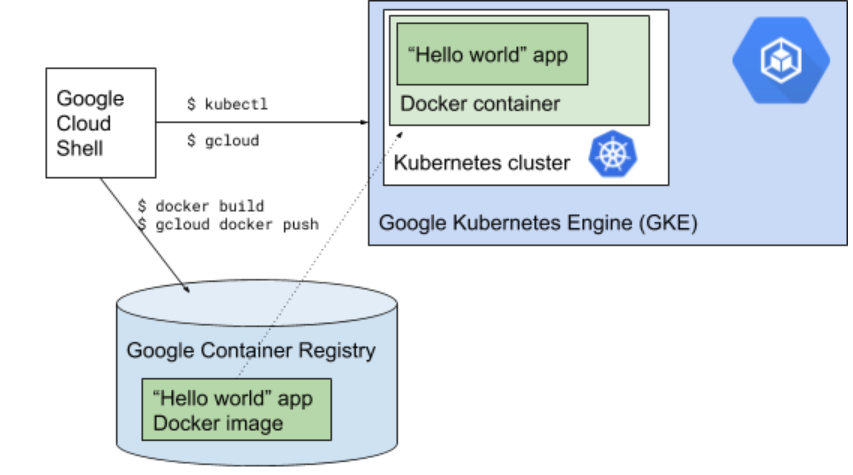

# 3. Containers in GKE


## requirements

- [ ] [GKE](https://cloud.google.com/kubernetes-engine/docs/getting-started-gke)
- [ ] Containers


[The Childrens Illustrated guide to Kubernetes](https://www.cncf.io/phippy/the-childrens-illustrated-guide-to-kubernetes/)

<!-- https://medium.com/the-node-js-collection/time-to-hello-world-part3-gke-9ca38e55eb6d -->


## “Hello, World” on Kubernetes Engine
Alright, containers… Bring ’em on!

Kubernetes Engine provides a managed environment for deploying, managing, and scaling your containerized applications using Google infrastructure. So let’s turn our simple “Hello World” into a replicated application running on Google’s hosted version of Kubernetes.


### Plan

- Create a Docker container image and push it to Google Container Registry
- Create a GKE cluster
- Deploy app to GKE cluster.
- Expose the app to external traffic
- Assess scaling on GKE





!!! note
    All in cloud-shell

## 1. Create a Docker container image

I already provide you with a Dockerfile. Open it and check it out.

```
vim src/python/Dockerfile

vim docker-compose.yml
```

We can easily build & push a Docker image from our Dockerfile using docker commands or do a shortcut using docker-compose.

```
docker-compose build

docker images

docker-compose push #or

gcloud docker -- push gcr.io/${GOOGLE_CLOUD_PROJECT}/python-gcp:v1.0
```


## 2. Create a GKE cluster

Let’s go ahead and create a cluster:

- Name: hello-world
- Machine type: small
- All other settings: default
Now I got my own Kubernetes cluster powered by GKE… Great!


## 3. Deploy app to GKE cluster

```
gcloud container clusters get-credentials ....

kubectl get nodes

kubectl run hello-world --image=gcr.io/${GOOGLE_CLOUD_PROJECT}/python-gcp:v1.0 --port=8080

```


## 4. Expose app to external traffic

```
kubectl expose deployment hello-world --type="LoadBalancer"

kubectl get services
```


## 5. Assess scaling on GKE

```
kubectl scale deployment hello-world --replicas=4
```

!!! info
    Kubernetes Engine also comes with the cluster autoscaler feature that automatically resizes clusters based on the demands of the workloads you want to run. (With autoscaling enabled, GKE automatically adds a new node to your cluster if you’ve created new pods that don’t have enough capacity to run; conversely, if a node in your cluster is underutilized and its pods can be run on other nodes, the node gets deleted.)
