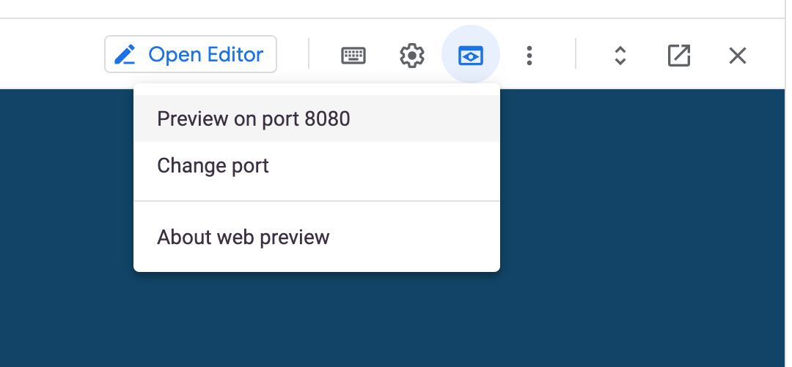

# Running our app for the first in cloud-shell

### Primer on Cloud Shell

- Cloud Shell is an online development and operations environment accessible anywhere with your browser. You can manage your resources with its online terminal preloaded with utilities such as the gcloud command-line tool, kubectl, and more. You can also develop, build, debug, and deploy your cloud-based apps using the online Cloud Shell Editor.


- Manage your Google Cloud resources with the flexibility of a Linux shell. Cloud Shell provides command-line access to a virtual machine instance in a terminal window.

- Many of your favorite command-line tools from bash and sh to emacs and vim are already pre-installed and kept up to date with Cloud Shell. Admin and development tools such as the gcloud command-line tool, MySql, Kubernetes, Docker, minikube, and Skaffold are configured and ready to use

## Getting Started

- Make sure you are in the right directory `cd ~/gcp-bootcamp`


There are two versions of the app:

- Python3
<walkthrough-editor-open-file filePath="~/gcp-bootcamp/src/python/app.py">
</walkthrough-editor-open-file>


- NodeJs
<walkthrough-editor-open-file filePath="~/gcp-bootcamp/src/nodejs/app.js">
</walkthrough-editor-open-file>


We can actually run the app purely using `python3 app.py` or `node app.js` but this is the magic of docker, you don't need to install anything other than docker. Also we can isolate different workload types in the same machine disregarding the app dependencies.

## Docker build the app

There seems to be a problem with OpenSSL, docker-compose and cloud-shell, to fix it run:

```
export LD_LIBRARY_PATH=/usr/local/lib
```

```bash
# at this point we can build the app using docker build or docker-compose build

# using docker-compose (recommended and will build python app)
docker-compose build

# you want to build the nodejs app?
PROJECT_LANG=nodejs docker-compose build

```


## Run the app

```bash
docker-compose up
```

All together:
```bash
docker-compose up --build
```

### View the app



Menu > Web Preview > Preview on Port 8080
